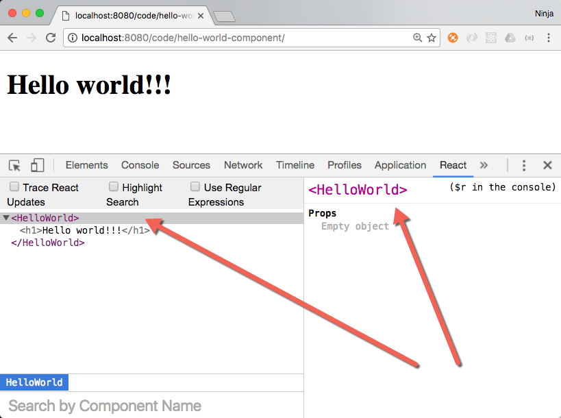
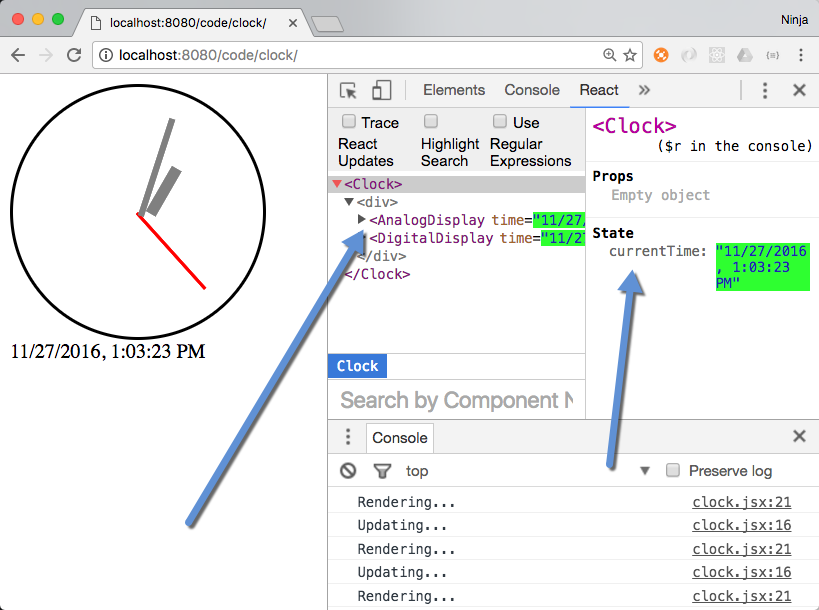

footer: © NodeProgram.com, Node.University and Azat Mardan 2017
slidenumbers: true

# React Foundation
## Module 2: Component-Based Architecture


Azat Mardan @azat_co


---

# Composable Components

The concept of components is the foundation of React.js philosophy. They allow you to reuse code and logic. They are like templates only better.

---

### Types of React.js Components

React.js component types:

* Regular HTML elements such as h1, p, div, etc.
* Custom or composable components

---

### Difference Between Regular and Custom Components

If it's a regular HTML tag name, then React.js will create such element. Otherwise, it will look for the custom component definition.

Note: React.js uses lower-case vs. upper case to distinguish between HTML tags and components.

---

### Defining a Component

Composable components are created with `class/extends` and must have `render` method that returns regular component (`div`, `h1`, etc.):

```js
const React = require('react')

class HelloWorld extends React.Component {
  render() {
    return <h1>Hello world!</h1>
  }
}
```

---

# Sidenote `createClass()`

Old style (ES5):

```js
var React = require('react')

var HelloWorld = React.createClass({
  render: function() {
    return (
      <h1>Hello world!!!</h1>
    )
  }
})
```

---

### Refactoring with a HelloWorld Component

The `hello-world-component/jsx/hello-world.jsx` file has a custom component:


```js
const React = require('react')
const ReactDOM = require('react-dom')

const HelloWorld = require('./hello-world.jsx')

ReactDOM.render(
  <HelloWorld/>,
  document.getElementById('content')
)
```

---

### HTML Skeleton

Point your `index.html` to use `js/bundle.js`:

```html
<!DOCTYPE html>
<html>
  <head>
  </head>
  <body>
    <div id="content"></div>
    <script src="js/bundle.js"></script>
  </body>
</html>
```

---


### Running the Code


Open `index.html` and check if you see Hello world! (Use `static`)

---



---


# Variables

Use `{}` to render variable inside of JSX:

```js
{a}
{' '}
{b}
```


---


Even use JavaScript in the curly braces!

```js
{Math.random()}
{365/7}
```

---

### Variable Example

```js
class Content extends React.Component {
  render() {
    let a = 1
    return (
      <div>
        <h1>
          {a}. Core React.js
        </h1>
        <p>This text is very useful for learning React.js.</p>
      </div>
    )
  }
}
```

---


# Props

Props or properties are immutable meaning they don't change. They are passed by parent components to their children.

---

### Using Props

```js
class ClickCounterButton extends React.Component {
  render() {
    return <button onClick={this.props.handler}>Don't click me {this.props.counter} times! </button>
  }
}
```

---

### Supplying Props

Provide props to the ClickCounterButton component:

```js
class Content extends React.Component {
  constructor(props) {
    super(props)
    this.state = {counter: 0}
    this.click = this.click.bind(this)
  }
  click(event) {
    this.setState({counter: ++this.state.counter})
  }
  render() {
    return (
      <div>
        <ClickCounterButton counter={this.state.counter} handler={this.click}/>
      </div>
    )
  }
}
```

<http://plnkr.co/edit/3HqvdG?p=preview>


---


# States

States are mutable properties of components meaning they can change. When state changes the corresponding view changes, but everything else in DOM remains intact.

---

### Initial State


```js
class Content extends React.Component {
  constructor(props) {
    super(props)
    this.state = {a: 0}
  }
  render() {
    // ...
  }
}
```

---

### Sidenote: ES5

The initial state is set by the `getInitialState` method which is called once when the element is created.

Let's use this method to return `a`:

```js
var Content = React.createClass({
  getInitialState: function(){
    return {a: 0}
  },
  render: function() {
    // ...
  }
})
```

---

### Updating State

State is updated with `this.setState()`, so this code will update the value with a random number every 300 milliseconds:

```js
class Content extends React.Component {
  constructor(props){
    super(props)
    this.state = {a: 0}
    setInterval(()=>{
      this.setState({a: Math.random()})
    }, 300)
  }
  render() {
    // ...
  }
}
```

---

### Outputting The State

To output the state property `a`, we use `{this.state.a}`:

```js
  render() {
    return (
      <div>
        <h1>Changing the State</h1>
        <p>This value is random: {this.state.a}</p>
      </div>
    )
  }
}
```

---


# Lists

---

### What are Lists

Lists are often use on webpages. They consist of many similar items wrapped in a parent element. Examples include:

* Menus
* Ordered and unordered lists
* Grids

---

### List Implementation

The easiest way to implement a list in React.js is to use array and map(), e.g.,

```js
render() {
  return (
    <ul>
      {this.props.items.map((value, index) =>{
        return <li>{value}</li>
      })}
    </ul>
  )
}
```

---

# Clock Project


Source: `code/clock`


---



---

## Demo 💻