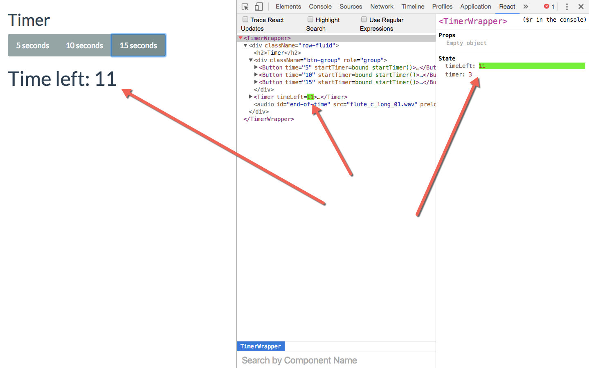

footer: © NodeProgram.com, Node.University and Azat Mardan 2017
slidenumbers: true

# React Foundation
## Module 3: User Input


Azat Mardan @azat_co


---


# Component Methods

---


### Calling Methods

It's possible to invoke components methods from the `{}` interpolation:

```js
class Content extends React.Component {
  getA() {
    return 10
  }
  render() {
    return (
      <div>
        <p>This value is return by the method: {this.getA()} </p>
      </div>
    )
  }
}
```

---

# Component Events

---

### Events

Components have normalized (cross-browser) events such as

```
onClick onContextMenu onDoubleClick onDrag onDragEnd onDragEnter onDragExit
onDragLeave onDragOver onDragStart onDrop onMouseDown onMouseEnter onMouseLeave
onMouseMove onMouseOut onMouseOver onMouseUp
```

---

### Declaring Events

React.js is declarative, not imperative. So we won't attach event like we would do with jQuery, instead we declare them in the JSX and classes:

```js
class Content extends React.Component {
  constructor(props) {
    super(props)
    this.state = {counter: 0}
    this.click = this.click.bind(this)
  }
  click(event) {
    this.setState({counter: ++this.state.counter})
  }
  render() {
    // ...
  }
}
```

---

### Button onClick Event

The button has the `onClick={this.click}`.


---

The name must match the method of the `Content` component class:

```js
...
  render() {
    return (
      <div>
        <button onClick={this.click}>Don't click me {this.state.counter} times!</button>
      </div>
    )
  }
})
```


<http://plnkr.co/edit/0wbmK9?p=preview>


---


### Where to Put logic

In this example, click event handler was in the parent element. You can put the event handler on the child itself, but using parent allows you to exchange info between children components.

Let's have a button:

```js
class ClickCounterButton extends React.Component {
  render() {
    return <button onClick={this.props.handler}>Don't click me! </button>
  }
}
```

---

### Exchanging Props Between Children

This is a new component which displays value prop:

```js
class Counter extends React.Component {
  render() {
    return <span>Clicked {this.props.value} times.</span>
  }
}
```


---

### Parent Component

The parent component provides props one of which is a handler:

```js
class Content extends React.Component {
  constructor(props) {
    super(props)
    this.state = {counter: 0}
    this.click = this.click.bind(this)
  }
  click(event) {
    this.setState({counter: ++this.state.counter})
  }
  render() {
    return (
      <div>
        <ClickCounterButton handler={this.click}/>
        <br/>
        <Counter value={this.state.counter}/>
      </div>
    )
  }
}
```

---


# Forms

---

### Form Elements

* input
* textarea
* option

---

### Synthetic Event


---

### Capture and Bubbling

Capture (first)

```js
onClickCapture = {this.handleClickCapture}
```

Bubbling (later):

```js
onClick = {this.handleClick}
```

---

### Form Events

Form support these events:

* onChange
* onInput
* onSubmit

---

### Form Elements

`<input>`, `<textarea>`, and `<option>` are special because they have mutable props (remember props are usually immutable)—value, checked and selected.

---

### Capturing Enter

You can use `onKeyUp` event to capture enter and trigger the submission of the data:


```js
keyup(event) {
  if (event.keyCode == 13) return this.sendData()
}
```

in render:

```html
<form onKeyUp={this.keyup.bind(this)}>
```

---


### Controlled Components

Controlled component means that the value prop is set. Typically it's tied to the `this.state.value`:

```js
render() {
  let value = this.state.value
  return <input type="text" value={value} onChange={this.handleChange} />
}
```

---

### Benefit of Controlled Components

Your element's internal state value will always be the same as the representation. It keeps things simple and in sync with React philosophy.


---

### Controlled Component Example

For example, if we have an account number input field it needs to accept only numbers. To limit the input to number (0-9) we can use a controlled component which will weed out all non-numeric values:

```js
  //...
  change(event) {
    this.setState({value: event.target.value.replace(/[^0-9]/ig, '')})
  }
  //...
```

---

### Controlled Component Example

```js
class Content extends React.Component {
  constructor() {
    this.state = {value: ''}
    this.change = this.change.bind(this)
  }
  //...
  render() {
    return <div>
      Account Number: <input type="text"
        onChange={this.change}
        placeholder="123456"
        value={this.state.value}/>
      <br/>
      <span>{this.state.value.length>0 ? 'You entered: ' +
       this.state.value: ''}</span>
    </div>
  }
}
//...
```

---

### Default Values

This is an anti-pattern because user will never be able to change the value in this controlled component:

```js
render() {
   return <input type="text" value="Hello!" />
 }
```

The right pattern is to use `defautValue` prop for setting default values:

```js
render() {
   return <input type="text" defaultValue="Hello!" />
 }
```

---

### Try it


Controlled demo: <http://plnkr.co/edit/ouADpl?p=preview>.


---

### Uncontrolled Components

Uncontrolled component simply means that the value prop is not set. To capture the changes from an an uncontrolled component, use `onChange`. For example,

```js
  render() {
    return <div>
      <input type="text"
        onChange={this.change}
        ref="textbox"
        placeholder="Hello!" />
      <span>{this.state.value}</span>
    </div>
  }
})
```

---

# Refs

---

### What is Refs

Refs are used to get the DOM element of a React.js component:

1. `render` has the ref attribute: `<input ref="email" />`
1. In code (e.g., event handler), access the instance via `this.refs.NAME` as in:   `this.refs.email`

---

### Refs' DOM

You can access the component's DOM node directly by calling `ReactDOM.findDOMNode(this.refs.NAME)`, e.g.,

```js
ReactDOM.findDOMNode(this.refs.email)
```


---

### Capturing Uncontrolled Components

This is the `change` method that updates the state:

```js
class Content extends React.Component {
  constructor(props) {
    super(props)
    this.state = {value: ''}
    this.change = this.change.bind(this)
  }
  change(event) {
    console.log(event.target.value)
    console.log(ReactDOM.findDOMNode(this.refs.textbox).value)
    this.setState({value: event.target.value})
  }
  render() {
    // ...
  }
}
```

---


```js
render() {
  return <div>
    <input type="text"
      onChange={this.change}
      placeholder="Hello!"
      ref="textbox"
      defaultValue={this.props.defaultValue || 'Howdy'}/>
    <span>{this.state.value}</span>
  </div>
}
```

---

Uncontrolled component demo: <http://plnkr.co/edit/zmmhXU?p=preview>.

---

## Let's put together browser events, component composition, props and states! :carousel_horse:

---

# Timer Project

Source code: `code/timer`

---




---

# Timer Overview

* 3 components: 2 presentational and one smart
* 3 buttons from a single component
* Webpack, JSX, Babel, modules, npm
* Static (`node-static`) is not included in package.json

`code/timer`


---

# Demo 💻

---

# Workshop: Timer

1. Move `Timer` and `Button` to separate files
1. Create a pause and resume buttons (could be one button as a toggle)
1. Create a reset button (separate component)
1. Create a custom timer with an input field (separate component)
1. Change to minutes, not seconds